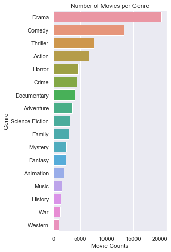
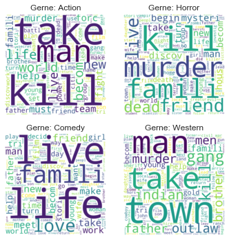

# Genre Prediction using Multilabel Classification and Natural Language Processing
Author: David S. White
 
Contact: dswhite2012@gmail.com

## Goal:
Most film databases tag each film  with genre(s) labels and provides text summarizing the plot of the movie. The goal of this project is to predict the genre(s) of a movie from its plot. Since each film can belong to multiple genres, this is multi-label classification problem. 

## Data Acquisition and Cleaning
Data were obtained from the open-sourced dataset: https://www.kaggle.com/rounakbanik/the-movies-dataset. In particular, the file movies_metadata.csv was used for this analysis. To the best of my knowledge, this data was curated by Rounak Banik and was developed for educational purposes. From the link above: 

>"These files contain metadata for all 45,000 movies listed in the Full MovieLens Dataset. The dataset consists of movies released on or before July 2017. Data points include cast, crew, plot keywords, budget, revenue, posters, release dates, languages, production companies, countries, TMDB vote counts and vote averages.">

"Genre" and "Overview" features were read into pandas array. Genre values were cleaned to ensure each label was a indeed a genre (e.g. Action, Adventure, Comedy, Horror, etc...). 

 
Next, plot text was parsed using 'nltk' library. Punctuation and stop-words were removed. Words were returned to root form using SnowballStemmer. When parsing by genre, it is clear that there are distinct and representative words that match expectations. Both Genres and Overview were encoded into binary features using a one-hot-encoder scheme. 

## Results
The data were first split into a training and test set (80%/20%). The top 5000 words were used for model building. Given the large number of features, I focused on using Logistic Regression. The optimal F1 value was determined using a threshold-moving approach. This resulted in an F1 value of 0.542 with precision = 0.492 and recall = 0.602 on the test-set post training. Overall, the model is providing adequate predictions with room for improvement, notably  a tendency to overfit the number of possible genres. 

## Next Steps: 
Something to consider is the correlation between the labels (e.g. a horror-thriller is more common than a horror-biography). Logistic regression cannot take this information into consideration but other models might be able to.
